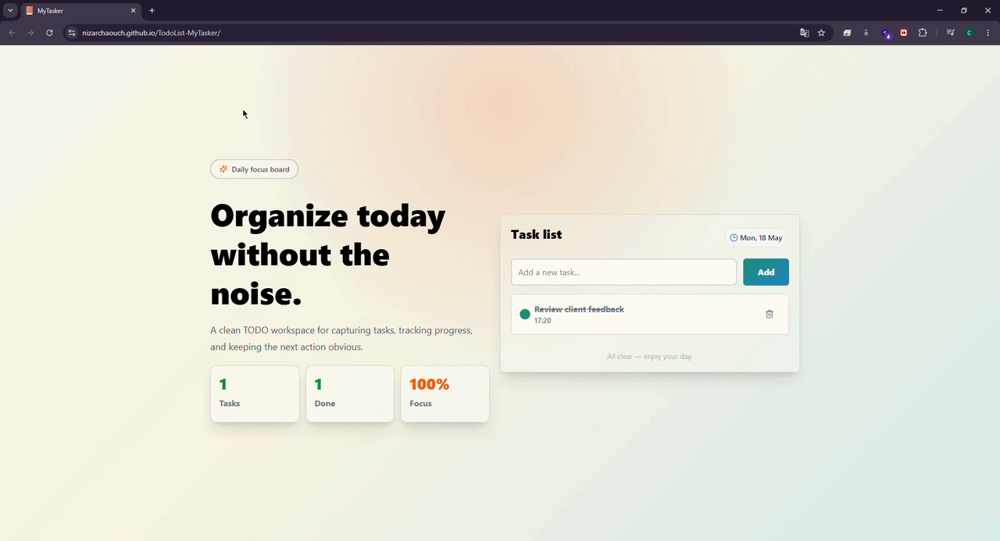
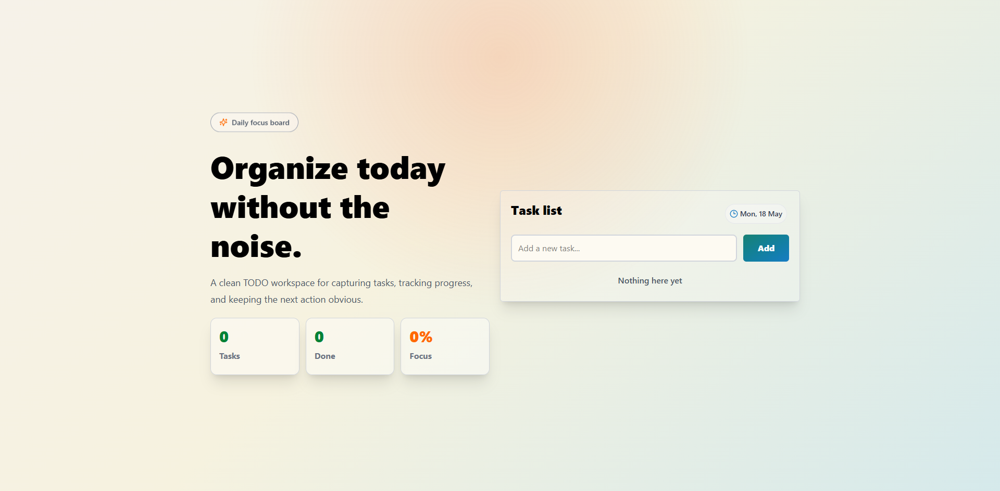
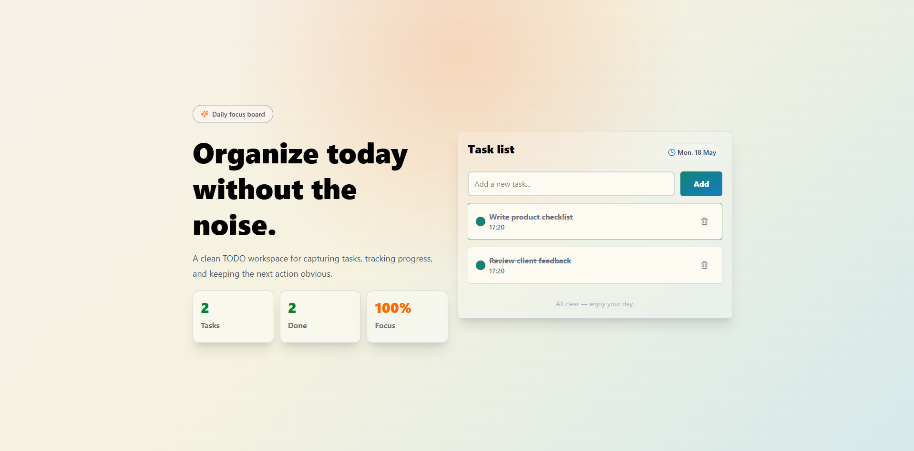
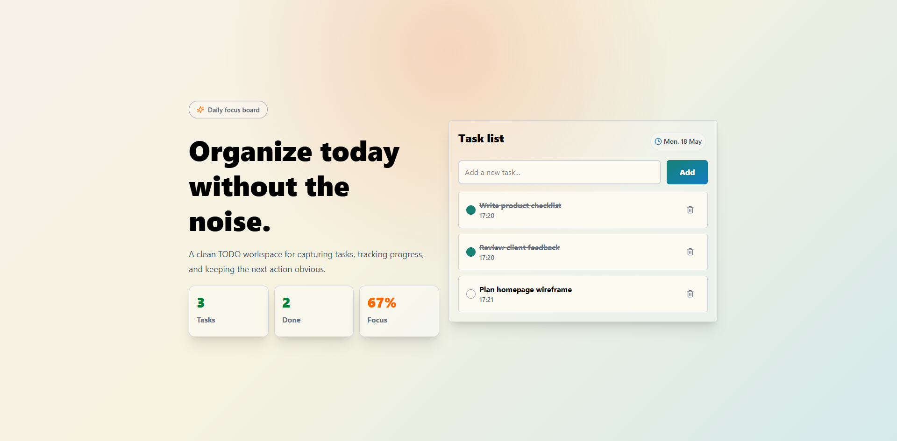
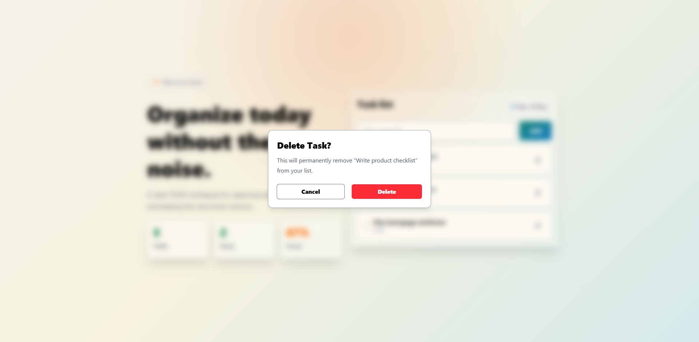

# Todo List App


A clean, responsive, and modern Todo List application built with **React.js**, **TypeScript**, **Vite**, and **Tailwind CSS**.

The app allows users to add tasks, mark them as completed, delete tasks, and track their progress.  
Tasks are stored locally in the browser using **localStorage**, so they remain saved even after refreshing the page.

---

## Live Demo

[View Live Project](https://nizarchaouch.github.io/TodoList-MyTasker/)

---

## Demo



---

## Screenshots

### Home Page



### Tasks Added




### Delete Confirmation Modal



---

## Features

- Add new tasks
- Mark tasks as completed
- Delete tasks with confirmation modal
- Track total number of tasks
- Track completed tasks
- Show progress percentage
- Store tasks in localStorage
- Responsive design
- Clean and modern UI
- Built with React and TypeScript

---

## Technologies Used

- React.js
- TypeScript
- Vite
- Tailwind CSS
- localStorage
- ESLint
- Git & GitHub
- GitHub Pages

---
## Installation

Clone the repository:

```bash
git clone https://github.com/nizarchaouch/TodoList-MyTasker.git
```

Go to the project folder:

```bash
cd Todo-list
```

Install dependencies:

```bash
npm install
```

---

## Project Structure

```bash
Todo-list/
├── public/
├── src/
│   ├── assets/
│   │   └── screenshots/
│   │       ├── demo.gif
│   │       ├── home.png
│   │       ├── tasks.png
│   │       └── delete-modal.png
│   ├── components/
│   │   ├── Alert.tsx
│   │   └── Card.tsx
│   ├── hooks/
│   │   └── useTasks.ts
│   ├── types/
│   │   └── Task.ts
│   ├── App.tsx
│   ├── main.tsx
│   └── index.css
├── package.json
├── vite.config.ts
├── tsconfig.json
└── README.md
```
---
## Author
**Nizar Chaouch**
